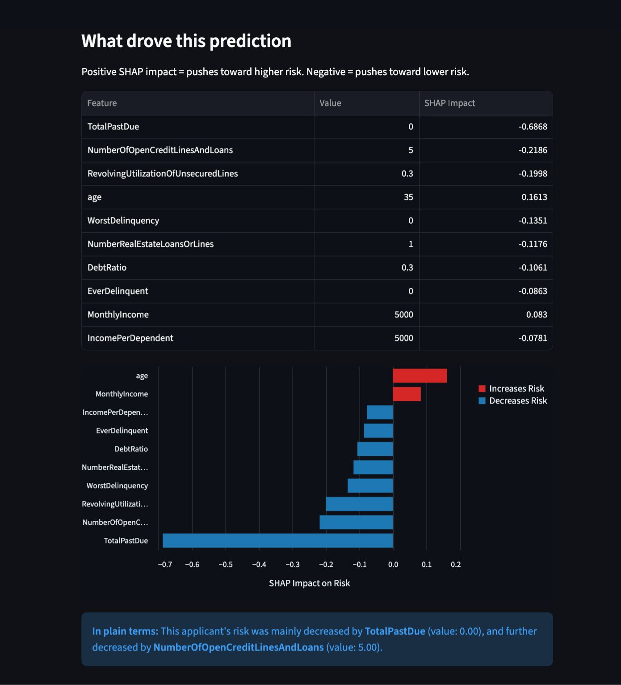

# Credit Risk Assessment

A machine learning system that predicts the probability a loan applicant will default, and recommends an approve/deny decision based on a cost-based threshold, with a live web app that explains why each individual prediction was made.

Live app: https://credit-risk-project-nzawhayqdbsvfn8jpdazxa.streamlit.app/

## The problem

Lenders need to decide whether to approve or deny credit applications. Getting this wrong in either direction is costly: approving a defaulter loses money outright, but denying a good applicant loses a paying customer. This project builds a model to predict default risk, picks a decision threshold based on the relative cost of each type of mistake, and explains what drove each individual recommendation.

Built on the Kaggle Give Me Some Credit dataset, about 150,000 historical loan records.

## Key results

Final model: XGBoost, calibrated with isotonic regression.
Test set performance: ROC-AUC 0.8657, PR-AUC 0.4098.
Operating threshold: 0.71, chosen via cost-based analysis.
Cross-validation finding: under 5-fold CV, XGBoost and Random Forest perform statistically indistinguishably, ROC-AUC 0.863 vs 0.864, PR-AUC 0.399 vs 0.398. XGBoost's edge on the original train test split did not hold up. It was retained as the final model for practical reasons, not a proven performance advantage.

## How it works

Raw applicant inputs such as age, income, and credit history go through feature engineering, 27 features built in features.py, then a calibrated XGBoost model produces a risk probability, which is compared against the 0.71 cost-based threshold to produce an Approve or Deny recommendation, alongside a SHAP explanation of which features drove that specific decision.

## Tech stack

Modeling: scikit-learn, XGBoost, SHAP. App: Streamlit, Altair. Data: pandas, numpy. Deployment: Streamlit Community Cloud, GitHub.

## Repo structure

app.py is the Streamlit app. features.py holds the standalone feature engineering. requirements.txt lists the deployment dependencies. credit-risk-project.ipynb contains the full analysis. The models folder holds the trained model files and metadata. The data folder holds the raw dataset.

## Run it locally

Clone the repo, create a virtual environment, install requirements.txt, then run streamlit run app.py.

## What I would do differently

Calibration-test Random Forest too, since only XGBoost was calibration-checked. Expand test coverage beyond the two manually verified cases. Add confidence intervals to the reported metrics.

## Data source

Kaggle Give Me Some Credit competition dataset.
